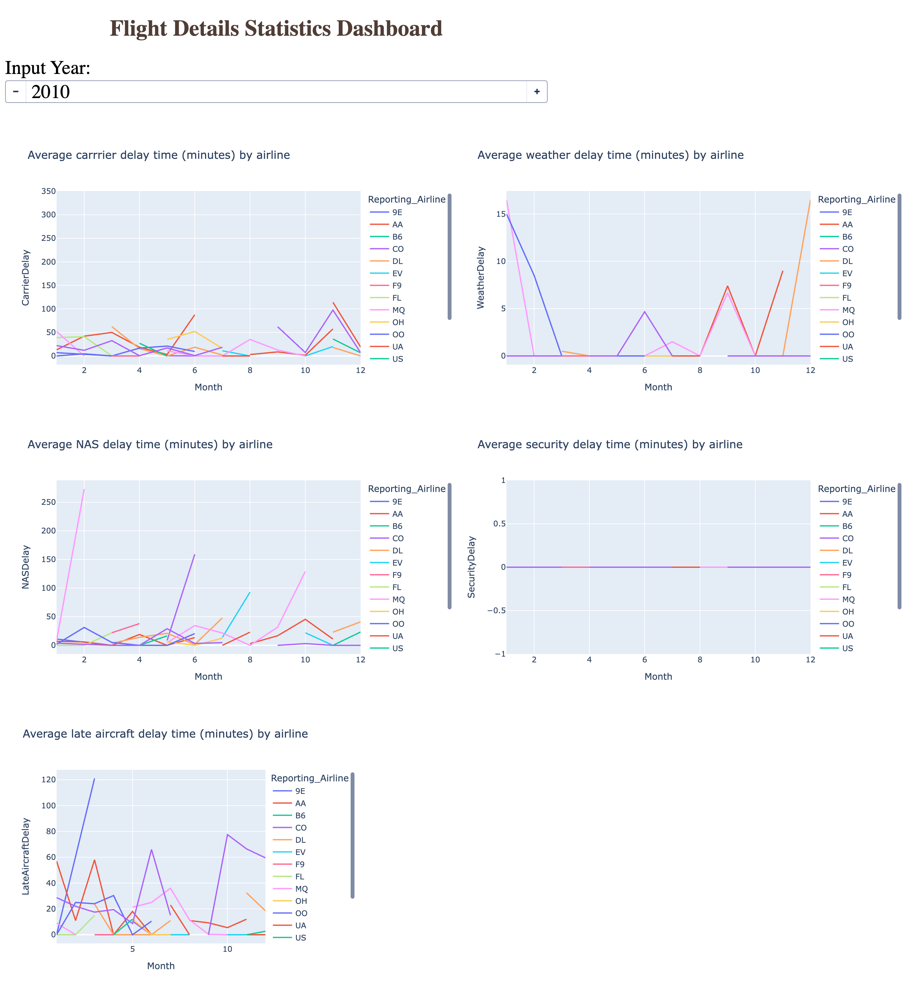

# Airline Performance Dashboard

This project is an interactive Python Dash dashboard analysing airline delay statistics.

## Dashboard Preview



## Features

- Year input for filtering airline delay data
- Line charts showing average carrier, weather, NAS, security and late aircraft delays
- Interactive Plotly visualisations
- Built using Python, Dash, Pandas and Plotly

## How to run

Install the required packages:

```bash
pip install -r requirements.txt